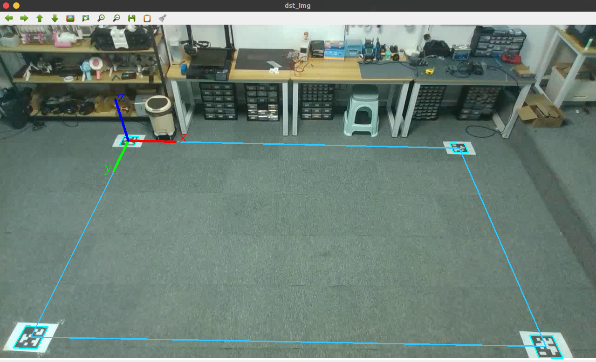
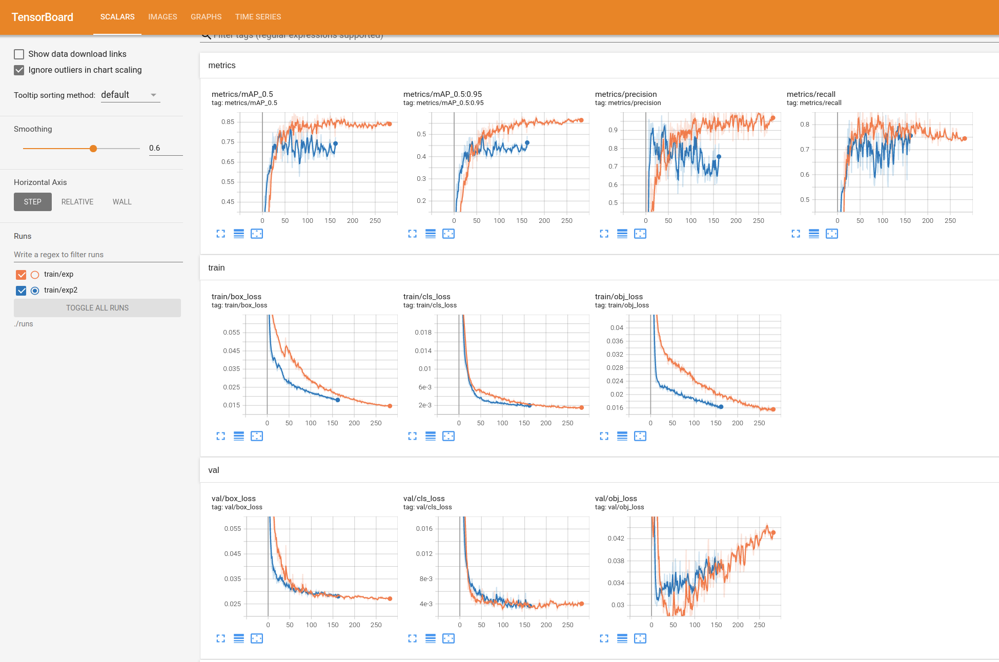
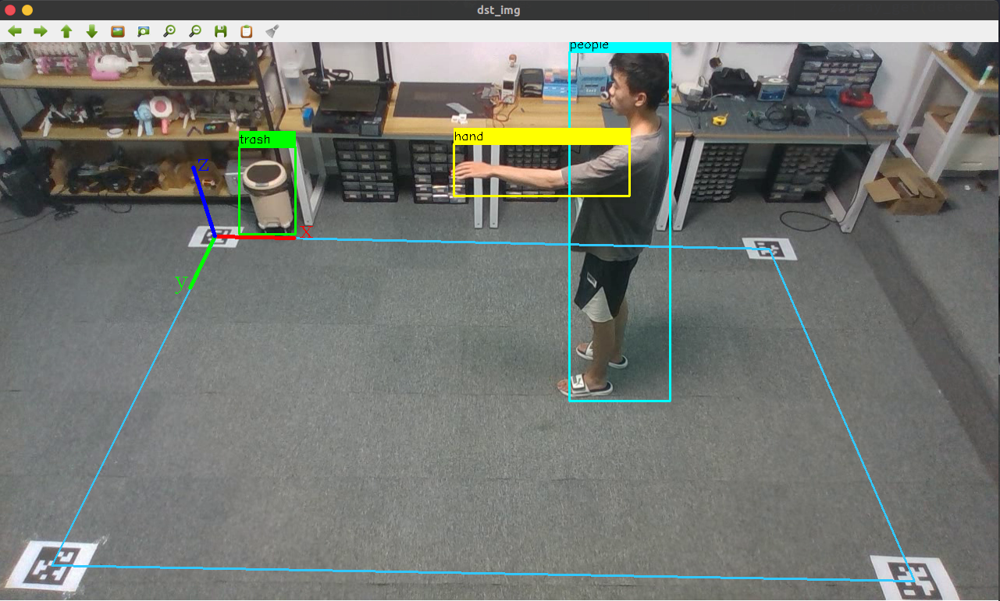
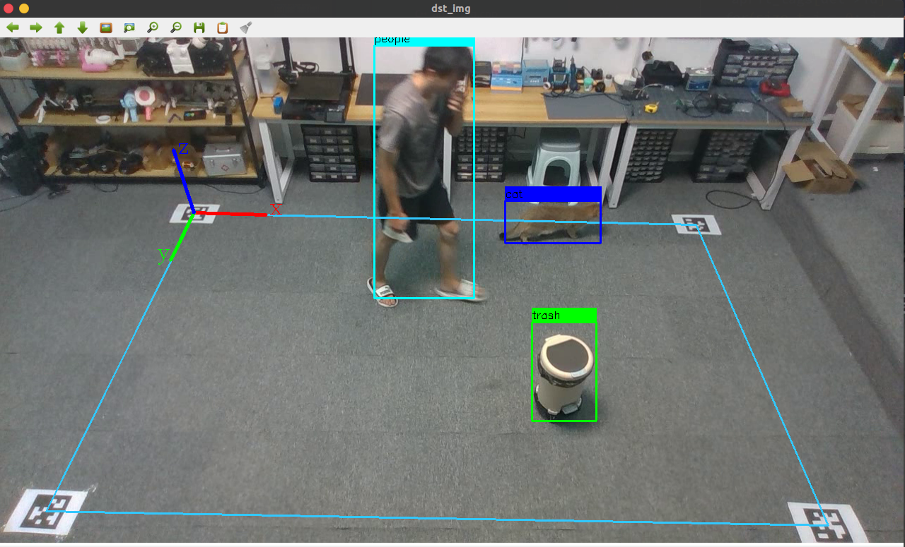
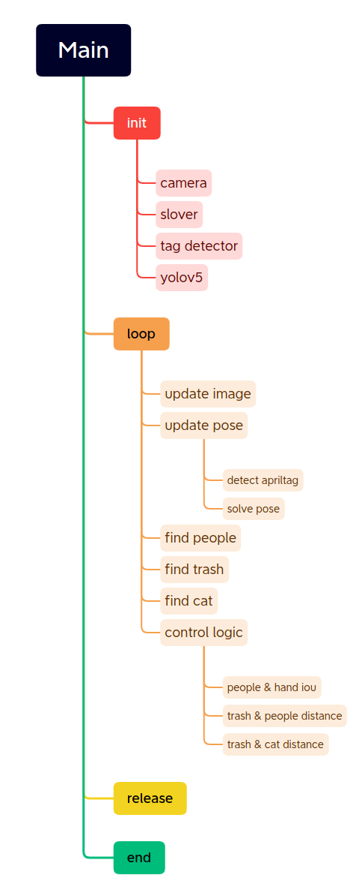

## 关于项目
- **`foolish trash bin (智障垃圾桶)`** 为不智能家居改造系列的作品

## 硬件设备
name | version 
---------|----------
 PC | Intel NUC8i5 (i5-8259U)
 Camera  | Intel Realsense depth camera D435i
## 运行环境

name | version 
---------|----------
 System | **[Ubuntu 20.04](https://wiki.ubuntu.com/FocalFossa/ReleaseNotes/)**
 CMake  | **[3.16.3](https://cmake.org/)**
 OpenCV | **[4.5.0](https://github.com/opencv/opencv/releases/tag/4.5.0)**
 librealsense | **[v2.50.0](https://github.com/IntelRealSense/librealsense/releases/tag/v2.50.0)**
 AprilTag | **[v3.2.0 ](https://github.com/AprilRobotics/apriltag/releases/tag/v3.2.0)**

### 位姿解算

通过地面排布的四个 `AprilTag` 二维码，通过 `SolvePNP` 方法求解位姿信息，并求解图像中二维点与三维空间点的映射

#### 二维码检测 

`modeules/april_tag` 中定义了 `AprilTagDetector` 类

``` cpp
zarray_t* AprilTagDetector::detectTag(cv::Mat _gray_img){
    image_u8_t img_header = {
        .width = _gray_img.cols,
        .height = _gray_img.rows,
        .stride = _gray_img.cols,
        .buf = _gray_img.data
    };

    return apriltag_detector_detect(this->td, &img_header);
}
```

真正执行检测的步骤为 `apriltag_detector_detect(this->td, &img_header);`

检测原理可以看这篇文章
- **[apriltag 代码解析](https://zhuanlan.zhihu.com/p/97124883)**




`modeules/solve_pose` 中定义了 `SolvePose` 类

``` cpp
void SolvePose::Solver(std::vector<cv::Point2f> img_2d, float w, float h);
```
输入点集以及真实尺寸，求解位姿矩阵

``` cpp
cv::Point3f SolvePose::coordinateImageToWorld(cv::Point2d img_uv);
```
求解二维点在三维坐标中的映射，不考虑 Z轴 高度，所以要确保输的点为正确的地面上的点

### 模型训练

参考开源目标检测仓库 **[ultralytics/yolov5](https://github.com/ultralytics/yolov5)**，参照其 `v-6.0` 版本进行模型训练和部署

详细步骤可以看
- 训练 **[yolov5 v6.0 train and convert to onnx](https://sinnammanyo.cn/personal-site/docs/computer/cv/ml-dl/yolo/yolov5-6.0-train)**
- 部署 **[使用 CV::DNN 模块读取 YOLO v5 ONNX 模型进行实时目标检测](https://sinnammanyo.cn/personal-site/docs/computer/cv/opencv/dnn/opencv-dnn-yolov5-6-0)**

下图为最终训练结果，第一次训练没有加入 `cat` 标签，数据集与标签数量选取得比较好，可以看到模型的收敛效果比较理想，第二次训练加入 `cat` 标签，但是由于数据量过小，导致模型难以收敛，最终程序自己停止了训练



从训练的效果来看，数据集的准备是比较差的 —— 场景固定，标签单一。这是的模型的鲁棒性不够强，是一个可改进的方向

最终的检测效果





### 控制逻辑



通过判断 `people` 与 `hand` 的 `box` 之间的 `iou` 面积，判断是否有举手的动作

如果有抬手的动作，则计算 `trash` 与 `people` 的 `box` 底部中点的三维映射点之间的距离关系，并执行路径的计算，由于应用场景的不同，控制这部分的程序就省略不传上来了，可以根据需要自行编写


## 参考与致谢
- **[D435i use apriltag with OpenCV](https://sinnammanyo.cn/personal-site/docs/computer/cv/realsense/intel-realsense-apriltag)**
- **[D435i apriltag Pose Estimation](https://sinnammanyo.cn/personal-site/docs/computer/cv/realsense/intel-realsense-intrinsics)**
- **[yolov5 v6.0 train and convert to onnx](https://sinnammanyo.cn/personal-site/docs/computer/cv/ml-dl/yolo/yolov5-6.0-train)**
- **[使用 CV::DNN 模块读取 YOLO v5 ONNX 模型进行实时目标检测](https://sinnammanyo.cn/personal-site/docs/computer/cv/opencv/dnn/opencv-dnn-yolov5-6-0)**